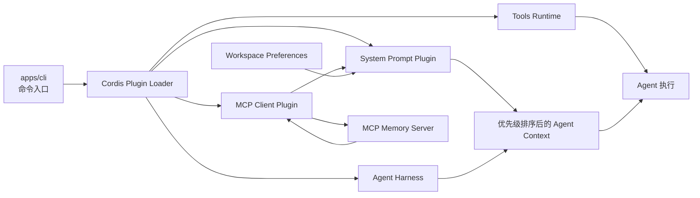
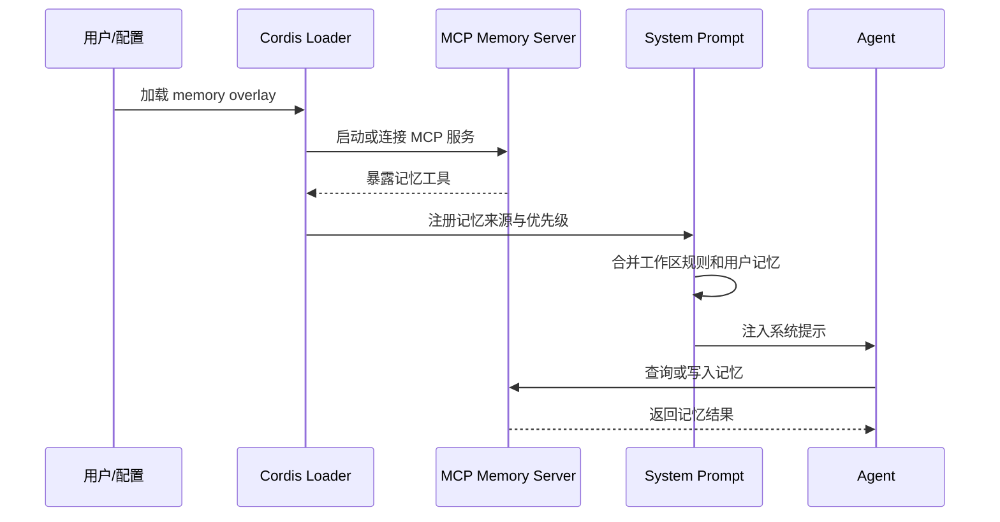

# DeepSeek Harness with Memory Plugin


> 基于 DeepSeek Harness 的可扩展 Agent Harness 示例，重点展示 **高优先级记忆、MCP 记忆服务接入、插件组合和工作区偏好** 如何进入 Agent 的运行上下文。

## 项目解决什么问题

DeepSeek Harness 采用 Plugin-First 架构，能力由插件组合而成。本仓库在 Harness 的基础上增加了面向记忆场景的配置与测试样例：记忆服务可以通过 MCP 接入，记忆内容可以在系统提示中以明确的优先级进入 Agent 上下文，工作区规则也可以作为运行约束被插件读取。

本项目不是一个独立的聊天机器人，也不把记忆数据上传到仓库。它更适合作为以下场景的基础设施样例：为 Agent 增加持久化上下文、验证插件组合、测试系统提示注入顺序，以及为不同工作区配置可复用的运行规则。

## 核心能力

| 能力 | 说明 |
|---|---|
| Plugin-First 组合 | 通过 Cordis 运行时加载 Harness、工具、系统提示和 MCP 客户端插件。 |
| 高优先级记忆 | 记忆服务返回的内容可以进入 Agent 的系统提示，而不是仅作为普通对话历史。 |
| MCP 记忆示例 | `examples/mcp-memory/` 提供 Memorix、Engram 和 MCP reference memory 的可选配置。 |
| 配置覆盖测试 | `apps/cli/tests/memory-mcp-configs.spec.ts` 使用 keyless fixture 验证配置能被解析和加载。 |
| 工作区偏好 | 可以将文件操作目录优先级等规则作为 Agent 的上下文约束。 |
| 可验证的运行边界 | 测试重点覆盖插件加载、配置解析、工具发现和系统提示注入。 |

## 架构



运行时的关键关系是：**MCP 记忆服务提供数据，MCP Client 负责连接，System Prompt Plugin 负责把上下文交给 Agent，Harness 负责编排 Agent 生命周期**。记忆服务本身不应被误解为模型训练或无限历史保存。

## 记忆注入流程



## 目录结构

```text
apps/cli/                 CLI、Web 启动入口和 CLI 测试
examples/mcp-memory/      可选的第三方 MCP 记忆配置
packages/                 Harness、Cordis、工具和运行时包
vendor/                   上游或 vendored 依赖
apps/cli/tests/           CLI、配置和 MCP fixture 测试
scripts/                  构建、文档生成和质量门禁脚本
```

## 快速开始

环境要求：Node.js `>=22.19.0` 或 `>=24.0.0`、pnpm `11.7.0` 和 Git。

```bash
git clone https://github.com/jingxinchen203-star/DeepSeek-Harness-Memory.git
cd DeepSeek-Harness-Memory
pnpm install
pnpm run build
pnpm dsh web
```

启动 Web UI 后访问 `http://127.0.0.1:3080`。如果只需要运行 CLI，可以使用：

```bash
pnpm dsh --help
```

## MCP 记忆配置

`examples/mcp-memory/` 中的配置是 **opt-in 示例**，不会在安装时自动下载或安装第三方记忆服务。使用前需要先安装对应服务，并确认命令可以在当前 shell 中直接执行。

| 文件 | 服务 | 用途 |
|---|---|---|
| `memorix.cordis.yml` | Memorix `1.3.0` | 通过 `memorix serve` 提供 MCP 记忆服务。 |
| `engram.cordis.yml` | Engram `1.20.0` | 通过 `engram mcp` 提供 MCP 记忆服务。 |
| `mcp-reference-memory.cordis.yml` | `@modelcontextprotocol/server-memory` `2026.7.4` | 使用本地 JSONL 文件保存 reference memory。 |

本地 reference memory 的文件位置可以通过环境变量覆盖：

```bash
export MEMORY_FILE_PATH="$HOME/.dsh-mcp-reference-memory.jsonl"
```

不要把 API key、个人记忆文件、工作区绝对路径或第三方服务的私有配置提交到 Git。配置示例应保持无密钥、可审阅、可在测试 fixture 中替换。

## 测试与质量检查

安装依赖后，建议按下面顺序执行：

```bash
pnpm exec vitest run apps/cli/tests/memory-mcp-configs.spec.ts
pnpm run check
pnpm run build
```

仓库还包含大量包级测试和文档、依赖、运行时闭包检查。完整质量门禁以 `package.json` 中的脚本为准；当本机缺少 Windows、PowerShell 或第三方 MCP 服务时，相应测试可能会按设计跳过。

## 安全边界

本项目会运行 Agent、插件和外部 MCP 进程。请将第三方 MCP 服务视为独立进程，检查其命令来源、工作目录、环境变量和数据落盘位置。不要在公共 issue、日志或 README 中粘贴密钥和私人记忆内容。

记忆注入的“高优先级”只表示它在 Harness 的系统提示组合中具有更高的规则优先级，不代表它可以突破宿主系统权限、文件系统权限或模型服务商的安全策略。

## 贡献方式

修改插件、配置或测试时，请同时补充对应的 fixture 或单元测试。提交前至少运行受影响包的测试、类型检查和构建；如果改动了配置示例，还应确认示例中没有密钥、私有路径和无法复现的本机状态。

## 许可证与致谢

本项目采用 [MIT License](LICENSE)。基础框架来自 [DeepSeek Harness](https://github.com/deepseek-ai/deepseek-harness)，插件运行时来自 [Cordis](https://github.com/cordiverse/cordis)。上游项目与第三方 MCP 服务分别遵循各自的许可证和使用条款。
